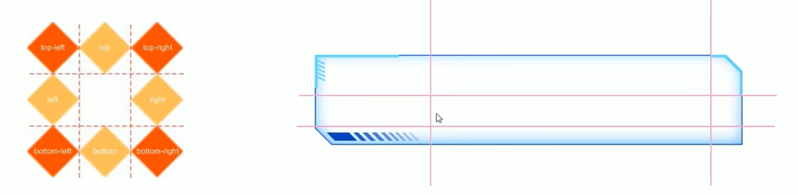
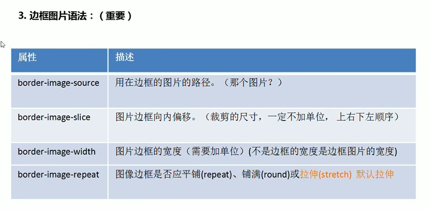
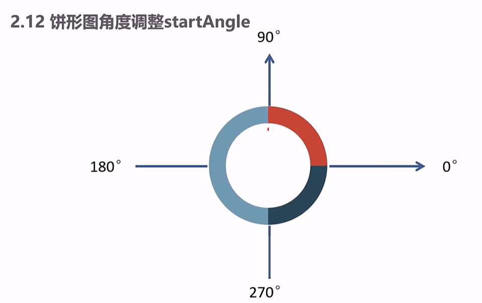

项目需求
设计稿是1920px
PC端适配: 宽度在1024和1920之间的页面元素宽高自适应

适配方案
插件：flexible.js
检测浏览器宽度
修改html文字大小

rem单位
页面元素根据rem适配大小
配合cssrem插件

flex布局
页面快速布局

flexible.js 把屏幕分为 24 等份
PC端的效果图是 1920px
cssrem 插件的基准值是 80px(1920 / 24) 
因为案例设计稿屏幕为1920px 此处分为 24 份采用1920 / 24 得到基准值 80px
配置按钮的 Root Font Size 里面设置

找到vscode里的 cssrem插件 并将基准值修改为 80

rem值自动生成

使用媒体查询把屏幕宽度约束在1024~1920 之间
这里的px 是通过页面宽度除以 24 份得到的
```
@media screen and (max-width: 1024px) {
  html {
    font-size: 42.66px !important
  }
}

@media screen and (min-width: 1920px){
  html {
    font-size: 80px!important
  }
}
```

效果图 1920 * 1078 px
body设置背景图
viewport主题容器，限制最小宽度 1024px，最大宽度1920px，最小高度780px
- 需要居中显示
- 使用logo png 作为背景,最大宽度1920px 最小高度 780px
- 内间距 上88px 左右20px 下0
- column 列容器,分三列 占比 3:4:3
- 中间容器外间距 32px 20px 0

边框图片
为了实现丰富多彩的边框效果,在CSS3中,新增了`border-images`属性,这个新属性允许指定一幅图像作为元素的边框
- 适用场景
盒子大小不一
边框样式相同

按照 上右下左 顺序切割
- 切图原理
把四个角切出去(九宫格的由来) 中间部分可以铺排 拉伸或者环绕

- 语法规范
- 

公共面板样式 panel
下边距20px
内部容器 .inner 内边距 上下24px 左右 36px (记得转换为rem单位)
标题 h3 白色 20px

注意：绝对定位的盒子也是贴着边框的里侧来显示，没有盖住里面的边框
→ 考虑对子盒子进行拉伸

通过类名调用字体图标
`<link rel='stylesheet' href="fonts/style.css">`
标签直接调用对应的类名即可（类名在css文件中标注）
`<span class="icon-angelllist"></sapn>`
引入css和声明字体图标时一定要注意路径问题

overview 概览区域
容器高度 110px
h4字体 28px #fff 左边距 4.8px 下间隙 8px
span 字体 16px #4c9bfd

无缝滚动原理
1. 先克隆marquee里面所有的行（row）
2. 通过CSS3动画滚动marquee
3. 鼠标经过marquee就停止动画
`animation-play-state:paused`

饼状图角度调整


全国热榜模块
实现思路：
- 准备后台返回的真实数据
- 利用数据渲染各省热销模块 sup模块 (拼接html格式字符串，进行渲染)
- 当数据进入tab的时候
  - 激活当前的tab样式， 删除其他的tab样式
  - 渲染各省热销sub模块 （拼接html格式字符串， 进行渲染）
- 默认激活第一个tab的效果
- 开启定时器，并依次切换 

ES6模板字符：
ES6模板字符可以极大地提高我们的开发效率
语法规范：
`${表达式}` // 模板字符串使用反勾号``并且允许自由换行